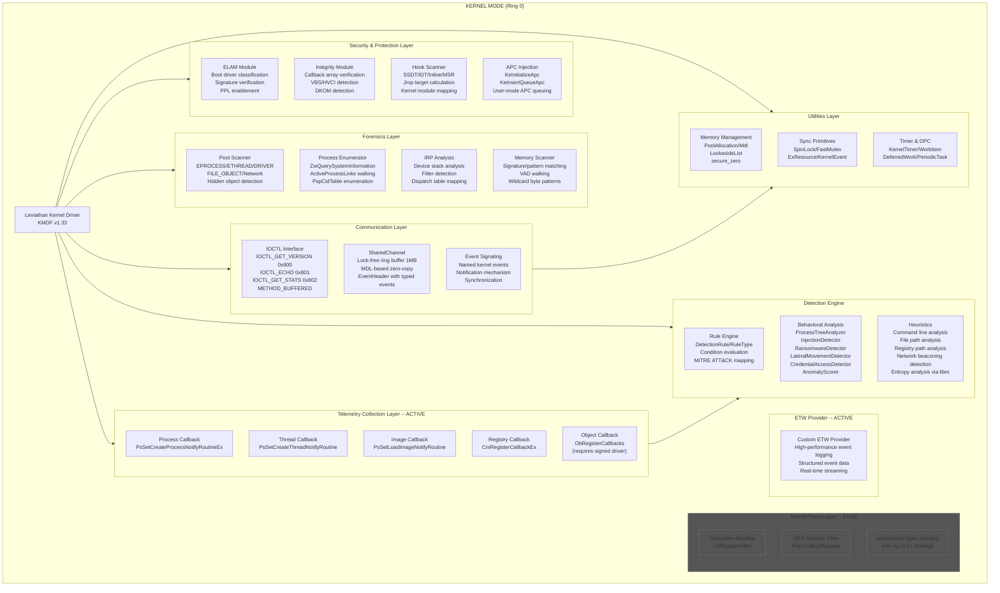
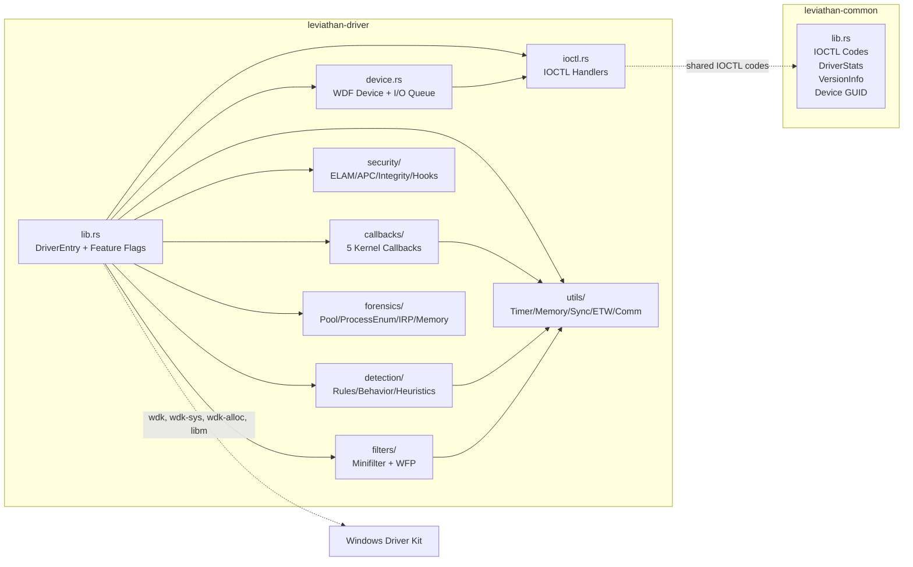
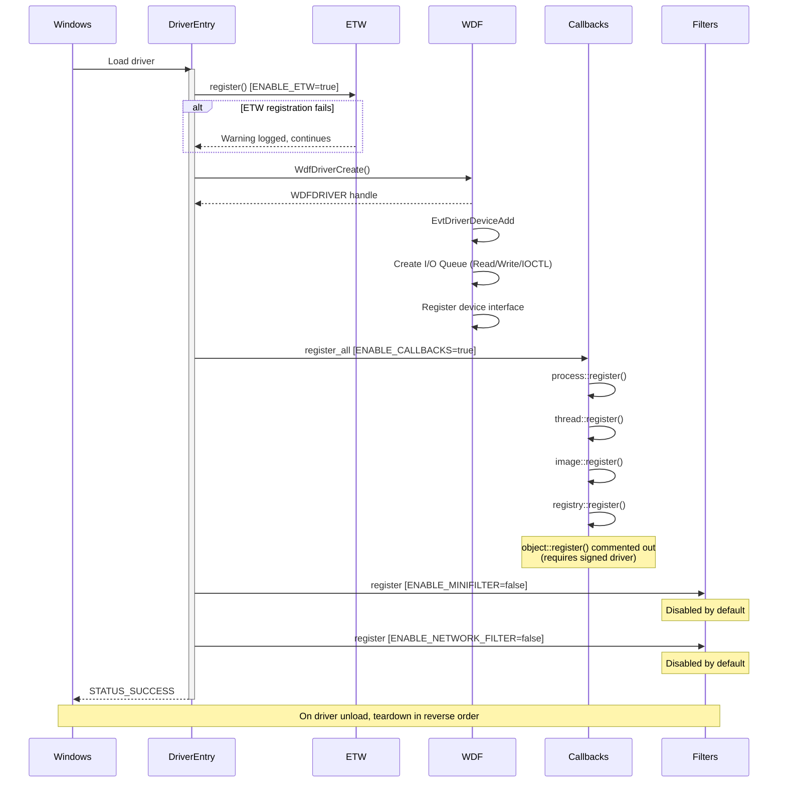
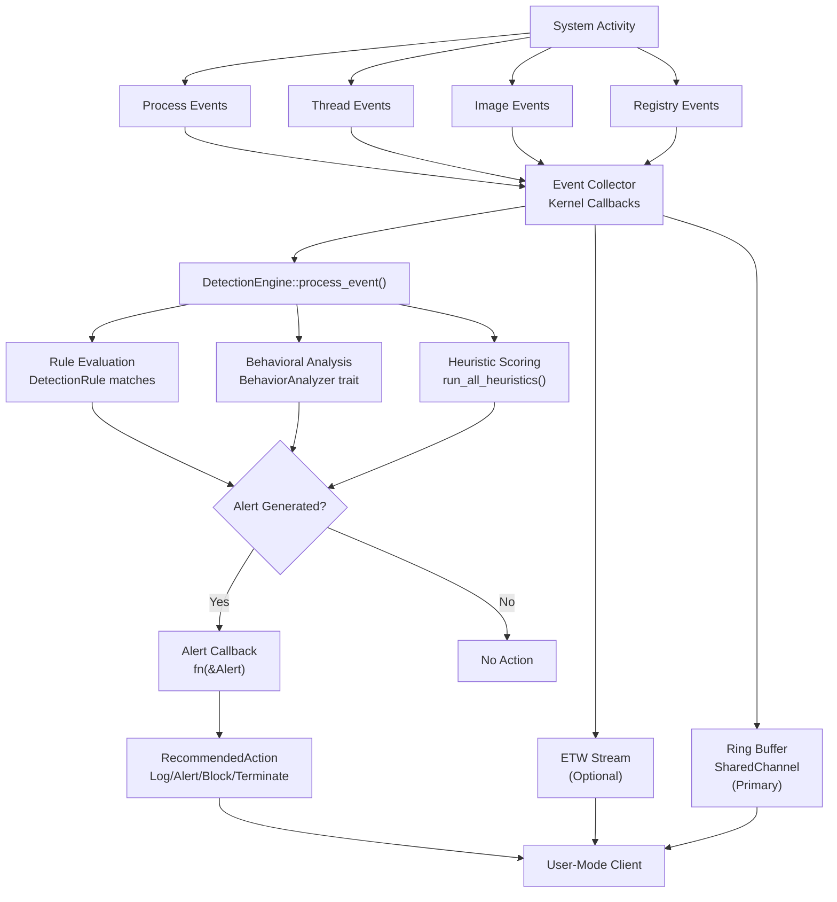
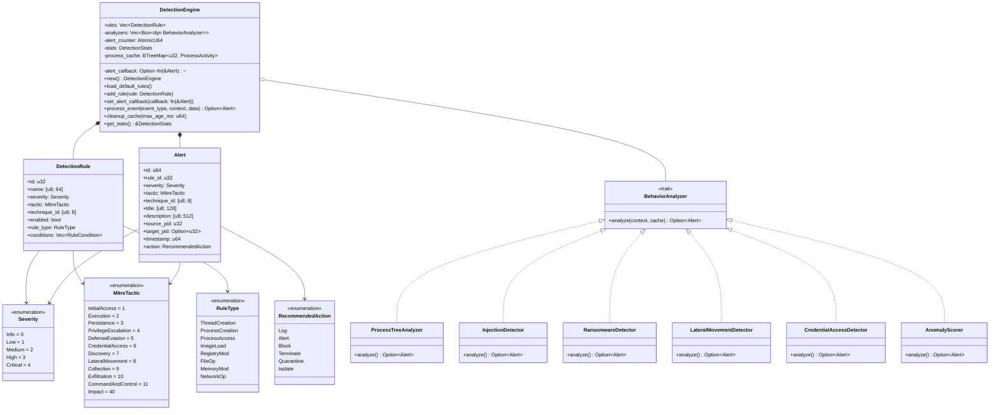
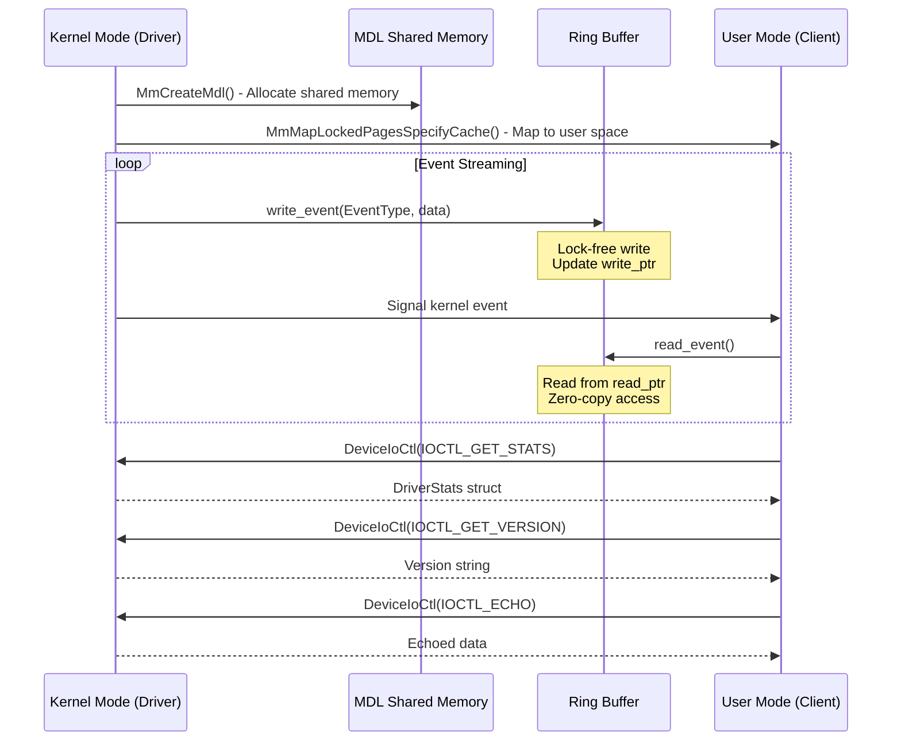

# Leviathan EDR/XDR Architecture

A comprehensive Windows kernel-mode security framework for building Endpoint Detection and Response (EDR) and Extended Detection and Response (XDR) solutions.

## System Architecture



## Module Dependency Graph



## Driver Initialization Sequence



## Event Data Flow



## Detection Engine Class Diagram



## Kernel-User Communication



## Feature Flags

The driver uses compile-time feature flags to enable/disable subsystems:

| Flag | Default | Status | Notes |
|------|---------|--------|-------|
| `ENABLE_CALLBACKS` | `true` | Active | Process, thread, image, registry callbacks |
| `ENABLE_MINIFILTER` | `false` | Stub | Placeholder types pending wdk-sys 0.5+ bindings |
| `ENABLE_NETWORK_FILTER` | `false` | Stub | Placeholder types pending wdk-sys 0.5+ bindings |
| `ENABLE_ETW` | `true` | Active | Custom ETW provider for event logging |

> **Note:** Object callback (`ObRegisterCallbacks`) requires a properly signed driver and is commented out in `init_driver` by default.

## Detection Capabilities Matrix

### Process Monitoring

| Technique | Detection Method | Data Source |
|-----------|------------------|-------------|
| Process Injection | Remote thread creation, APC queuing | Thread callback |
| Parent PID Spoofing | Parent-child relationship validation | Process callback |
| Command Line Obfuscation | Command line analysis | Process callback |
| Process Hollowing | Memory protection changes | Heuristic engine |

### Memory Attacks

| Technique | Detection Method | Data Source |
|-----------|------------------|-------------|
| Shellcode Injection | Signature/pattern scanning | Memory scanner |
| DLL Injection | Remote LoadLibrary calls | Image callback |
| Reflective DLL Loading | Manual mapping detection | Memory scanner |
| DKOM | Multi-method enumeration | Process enumerator |

### Persistence Mechanisms

| Technique | Detection Method | Data Source |
|-----------|------------------|-------------|
| Registry Run Keys | Key modification monitoring | Registry callback |
| Services | Service creation/modification | Registry callback |
| DLL Search Order Hijacking | Path validation | Image callback |

### Defense Evasion

| Technique | Detection Method | Data Source |
|-----------|------------------|-------------|
| AMSI Bypass | Memory patching detection | Memory scanner |
| ETW Patching | ETW integrity monitoring | Integrity module |
| Unhooking | Hook restoration detection | Hooks module |
| DKOM | Multi-method enumeration | Process enumeration |

### Ransomware Detection

| Indicator | Detection Method | Data Source |
|-----------|------------------|-------------|
| Mass File Encryption | Entropy analysis (via libm) | Heuristic engine |
| Network Beaconing | Statistical timing analysis | Heuristic engine |
| Known Signatures | Pattern matching | Memory scanner |

## Component Details

### 1. Kernel Driver (`leviathan-driver`)

The kernel driver operates at Ring 0 and provides:

- **Real-time telemetry collection** via kernel callbacks (process, thread, image, registry)
- **File system monitoring** via minifilter (stub - pending wdk-sys bindings)
- **Network monitoring** via WFP callouts (stub - pending wdk-sys bindings)
- **Detection engine** with rules, behavioral analysis, and heuristics
- **Memory forensics** capabilities (pool scanning, process enumeration, IRP analysis, memory scanning)
- **Anti-tampering** protection (SSDT/IDT/inline hook detection, callback integrity)
- **ETW provider** for high-performance event logging

### 2. Shared Types (`leviathan-common`)

A `no_std` crate providing shared types for kernel-user communication:

- **IOCTL codes**: `IOCTL_GET_VERSION`, `IOCTL_ECHO`, `IOCTL_GET_STATS`
- **`DriverStats`**: Read/write/ioctl counters shared between kernel and user mode
- **`VersionInfo`**: Structured version information
- **`DEVICE_INTERFACE_GUID`**: Device interface GUID for user-mode discovery

### 3. Communication Layer

High-performance kernel-to-user communication via `utils::comm`:

- **`SharedChannel`** with lock-free ring buffer (default 1MB)
- **MDL-based memory mapping** for zero-copy data sharing
- **`EventHeader`** with typed events (process, thread, image, file, registry, network)
- **IOCTL interface** for control operations (version, echo, stats)
- **`ChannelStats`** for monitoring channel health

## Building an EDR with Leviathan

### Step 1: Core Telemetry

```rust
// Register callbacks for system monitoring (called in DriverEntry)
unsafe { callbacks::process::register() }?;
unsafe { callbacks::thread::register() }?;
unsafe { callbacks::image::register() }?;
unsafe { callbacks::registry::register() }?;

// Or register all at once:
unsafe { callbacks::register_all_callbacks() }?;
```

### Step 2: Threat Detection

```rust
// Create detection engine with default rules
let mut engine = detection::DetectionEngine::new();
engine.load_default_rules();
engine.set_alert_callback(handle_alert);

// Process events through detection
let alert = engine.process_event(
    detection::EventType::ThreadCreate,
    &context,
    &event_data,
);
```

### Step 3: Memory Forensics

```rust
// Scan for hidden processes via pool tags
let processes = forensics::pool_scanner::scan_for_processes();
let drivers = forensics::pool_scanner::scan_for_drivers();

// Multi-method process enumeration for DKOM detection
let mut enumerator = forensics::process_enum::ProcessEnumerator::new();
let _ = unsafe { enumerator.enumerate_all() };
let hidden = forensics::process_enum::detect_dkom(&enumerator);
```

### Step 4: Hook Detection

```rust
// Scan for SSDT, IDT, and inline hooks
let scanner = security::hooks::HookScanner::new();
let result = scanner.scan_all();

// Verify kernel callback integrity
let tampered = security::integrity::verify_callbacks();
```

### Step 5: Kernel-User Communication

```rust
// Set up shared channel for telemetry
let mut channel = utils::comm::SharedChannel::new(1024 * 1024)?; // 1MB
channel.write_event(
    utils::comm::EventType::ProcessCreate,
    &process_event_data,
)?;
```

## Build Configuration

### Toolchain

- **Rust nightly** with `rust-src`, `rustfmt`, `clippy`, `llvm-tools-preview` components
- **Targets**: `x86_64-pc-windows-msvc`, `aarch64-pc-windows-msvc`
- **Build-std**: `core`, `alloc` with `compiler-builtins-mem`
- **`fma`/`fmaf` workaround**: `extern "C"` shims for rust-lang/rust#143172 linker regression

### Dependencies

| Crate | Version | Purpose |
|-------|---------|---------|
| `wdk` | 0.4 | KMDF/WDM bindings |
| `wdk-sys` | 0.5 | Low-level WDK FFI |
| `wdk-alloc` | 0.4 | Kernel memory allocator |
| `wdk-panic` | 0.4 | Kernel panic handler |
| `wdk-build` | 0.5 | Build script support |
| `libm` | 0.2 | Math functions (log2, sqrt) for entropy/beaconing detection |
| `leviathan-common` | 0.3.0 | Shared IOCTL codes and types |

## Security Considerations

### Driver Signing

Production deployment requires:

1. **EV Code Signing Certificate** for kernel driver signing
2. **Microsoft attestation signing** for Windows 10+
3. **WHQL certification** for broad deployment

### ELAM Requirements

For ETW Threat Intelligence access:

1. **Microsoft Virus Initiative (MVI)** partnership
2. **ELAM certificate** from Microsoft
3. **PPL service** registration

### HVCI Compatibility

For Virtualization-Based Security:

1. No dynamic code generation
2. No writable+executable memory
3. Proper memory protection flags

## References

### Microsoft Documentation
- [Windows Driver Kit (WDK)](https://docs.microsoft.com/windows-hardware/drivers/)
- [Kernel-Mode Driver Framework](https://docs.microsoft.com/windows-hardware/drivers/wdf/)
- [File System Minifilter Drivers](https://docs.microsoft.com/windows-hardware/drivers/ifs/file-system-minifilter-drivers)
- [Windows Filtering Platform](https://docs.microsoft.com/windows/win32/fwp/windows-filtering-platform-start-page)

### Security Research
- [EDR Internals](https://docs.contactit.fr/posts/evasion/edr-internals/) - Comprehensive EDR architecture
- [ETW Threat Intelligence](https://fluxsec.red/event-tracing-for-windows-threat-intelligence-rust-consumer) - Rust ETW-TI consumer
- [Kernel ETW](https://www.elastic.co/security-labs/kernel-etw-best-etw) - Elastic Security Labs
- [SSDT Hooking Detection](https://www.adlice.com/kernelmode-rootkits-part-1-ssdt-hooks/) - Rootkit detection

### Memory Forensics
- [Pool Tag Scanning](https://www.sciencedirect.com/science/article/pii/S1742287617300592) - Memory scanning with YARA
- [DKOM Detection](https://volatility-labs.blogspot.com/) - Volatility Framework

### Ransomware Detection
- [RansomWatch](https://github.com/RafWu/RansomWatch) - Minifilter-based ransomware detection
- [Entropy Analysis](https://academic.oup.com/cybersecurity/article/11/1/tyaf009/8109429) - High-entropy file detection

## License

MIT OR Apache-2.0
