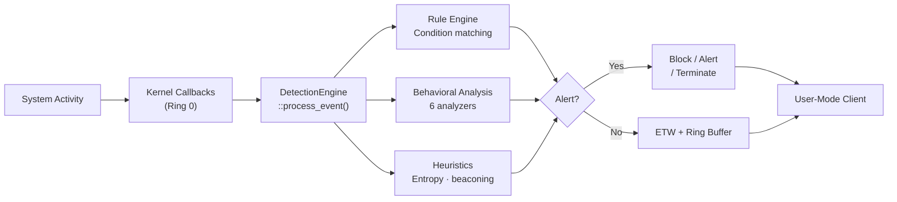
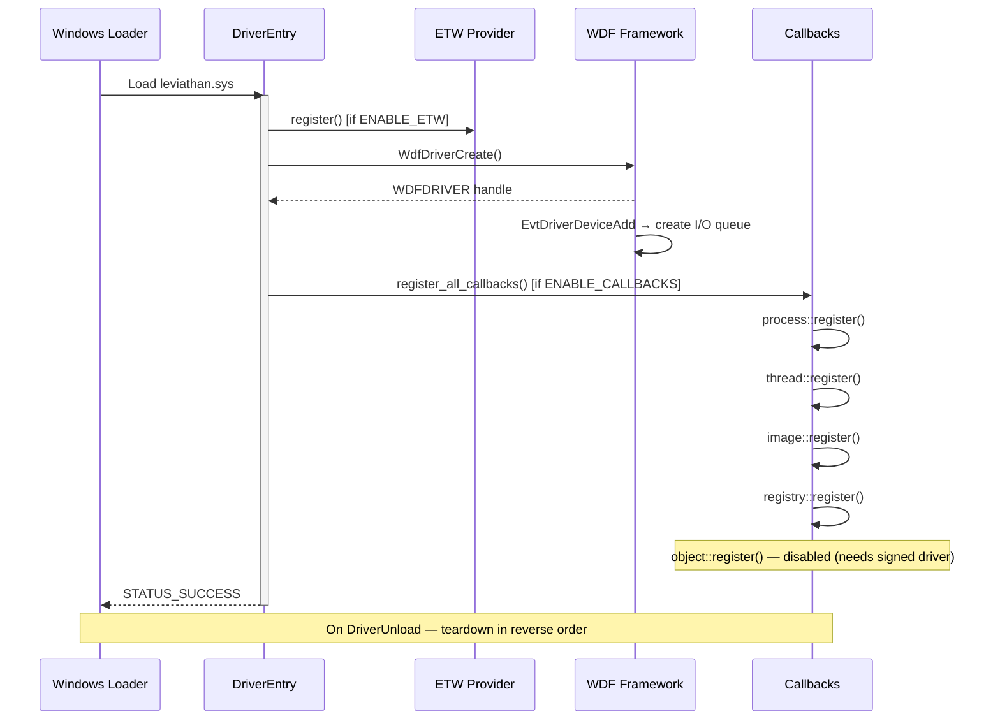
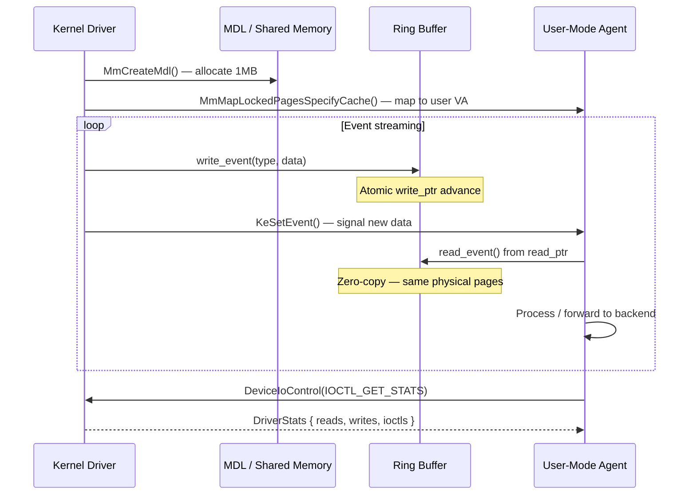

# Leviathan

<div align="center">

**Windows Kernel-Mode EDR/XDR Framework in Rust**

[](https://crates.io/crates/leviathan-driver)
[](https://crates.io/crates/leviathan-common)
[](https://github.com/anubhavg-icpl/leviathan)
[](https://www.rust-lang.org)
[](https://www.microsoft.com/windows)
[](https://github.com/anubhavg-icpl/leviathan)
[](https://docs.microsoft.com/windows-hardware/drivers/wdf/)

*Ring 0 telemetry collection · behavioral threat detection · memory forensics · hook detection · ELAM*

</div>

---


*End-to-End EDR/XDR Framework Architecture. Illustration by [Anubhav Gain](https://www.linkedin.com/in/anubhavgain/).*


---

## What is Leviathan?

Leviathan is a production-grade **Windows kernel-mode driver framework** written entirely in Rust, built on top of Microsoft's [windows-drivers-rs](https://github.com/microsoft/windows-drivers-rs). It provides all the Ring 0 primitives needed to build a complete **Endpoint Detection and Response (EDR)** or **Extended Detection and Response (XDR)** product from scratch — telemetry collection, threat detection, behavioral analysis, memory forensics, anti-tamper protection, and high-throughput kernel-to-user communication.

The project is not a toy driver. It implements the same core primitives that commercial EDR vendors build on: kernel callbacks for every relevant system event, a rules-and-behavioral detection engine with MITRE ATT&CK coverage, pool-tag memory forensics for rootkit hunting, SSDT/IDT/MSR hook scanning, and a lock-free ring buffer for zero-copy event streaming to user space. All of this runs in a single `cdylib` kernel driver compiled with `no_std` Rust.

**Why Rust?** Writing a kernel driver in C or C++ is extremely hazardous — a buffer overread, a null dereference, or a race condition in Ring 0 causes an immediate BSOD and can corrupt system state irreparably. Rust's ownership model, borrow checker, and lack of undefined behavior catch the entire class of memory-safety bugs that historically plague kernel code, at compile time. The `wdk` and `wdk-sys` crates wrap Windows Driver Kit APIs with Rust-idiomatic safety boundaries, and the `wdk-alloc` and `wdk-panic` crates provide correct kernel-mode allocator and panic behavior. The result is Ring 0 code that is both safe and zero-overhead.

---

## Capability Overview

| Category | Subsystem | Status |
|----------|-----------|--------|
| **Telemetry** | Process, Thread, Image, Registry, Object callbacks | Active |
| **Detection** | Rule engine, behavioral analyzers, heuristics | Active |
| **Protection** | ELAM, hook detection, integrity monitoring | Active |
| **APC** | Kernel-to-user APC injection (`KeInitializeApc`) | Active |
| **Forensics** | Pool scanner, process enumeration, IRP analysis, memory scanner | Active |
| **Communication** | Lock-free ring buffer, MDL shared memory, IOCTL | Active |
| **ETW** | Custom ETW provider, structured event streaming | Active |
| **Filesystem** | Minifilter (FltRegisterFilter) | Stub |
| **Network** | WFP callout filter | Stub |

---

## Architecture

Leviathan is organized as a Cargo workspace with two crates:

```
leviathan/
├── crates/
│   ├── leviathan-driver/          # cdylib kernel-mode driver (Ring 0)
│   └── leviathan-common/          # no_std shared types (kernel + user)
├── .cargo/config.toml             # build-std, kernel linker flags
├── Makefile.toml                  # cargo-make tasks
├── rust-toolchain.toml            # pinned nightly toolchain
└── Cargo.toml                     # workspace manifest
```

The driver crate compiles as a `cdylib` that becomes `leviathan_driver.dll`, which is renamed to `leviathan.sys` by the package task. The common crate is `no_std` + `no_alloc` so it can be used from both the kernel driver and any user-mode client without pulling in the standard library.

### High-Level System Diagram

```mermaid
graph TB
    subgraph KERNEL["KERNEL MODE (Ring 0)"]
        DRIVER["Leviathan Kernel Driver · KMDF v1.33"]

        subgraph TELEMETRY["Telemetry Collection — ACTIVE"]
            CB["Process | Thread | Image | Registry | Object"]
        end

        subgraph SECURITY["Security & Protection"]
            SEC["ELAM | Integrity | Hook Detection | APC"]
        end

        subgraph DETECTION["Detection Engine"]
            DET["Rule Engine | Behavioral Analysis | Heuristics"]
        end

        subgraph FORENSICS["Forensics"]
            FOR["Pool Scanner | Process Enum | IRP Analysis | Memory Scanner"]
        end

        subgraph COMMS["Communication"]
            COM["Ring Buffer | Shared Memory | IOCTL | ETW"]
        end

        subgraph FILTERS["Kernel Filters — STUB"]
            FIL["Minifilter | WFP Network"]
        end
    end

    subgraph USER["USER MODE"]
        CLIENT["EDR User-Mode Agent"]
    end

    DRIVER --> TELEMETRY & SECURITY & DETECTION & FORENSICS & COMMS
    TELEMETRY --> DETECTION
    COMMS <--> CLIENT

    style FILTERS fill:#444,stroke:#777,stroke-dasharray:5 5
    style FIL fill:#444,stroke:#777,stroke-dasharray:5 5
```



### Event Processing Pipeline

Every system event follows this path from raw kernel callback to user-mode alert:




---

## Module Breakdown

### Telemetry Collection (`callbacks/`)

The callbacks module registers five kernel callback types that cover the entire spectrum of process, thread, binary, registry, and object activity on the system.

**`callbacks/process.rs` — `PsSetCreateProcessNotifyRoutineEx`**

Called synchronously for every process creation and termination on the system. The notification includes the parent PID, image file name, command line, and a flag indicating whether this is a creation or exit event. Leviathan captures all of this into a `ProcessEvent` and feeds it directly into the detection engine before the new process has had a chance to execute user-mode code. This is the earliest possible point to detect suspicious process chains (e.g., `winword.exe` spawning `powershell.exe`).

**`callbacks/thread.rs` — `PsSetCreateThreadNotifyRoutine`**

Fires for every thread creation and termination. The key detection signal here is *cross-process thread creation*: if the creating PID differs from the target PID, this is the canonical sign of remote thread injection (T1055). The `InjectionDetector` behavioral analyzer checks exactly this condition.

**`callbacks/image.rs` — `PsSetLoadImageNotifyRoutine`**

Called when any PE image (EXE, DLL, driver) is mapped into memory. Provides the full image path and the load address, which lets Leviathan catch reflective DLL loading (image loaded from an unusual path or a `[memory]` path), DLL hijacking (unexpected directory for a system DLL), and suspicious library loading sequences.

**`callbacks/registry.rs` — `CmRegisterCallbackEx`**

Intercepts all registry operations: key creation, value set, key deletion, and key enumeration. Run-key writes (e.g., `HKLM\SOFTWARE\Microsoft\Windows\CurrentVersion\Run`) are a canonical persistence mechanism (T1547) and are caught here before the write completes.

**`callbacks/object.rs` — `ObRegisterCallbacks`**

Intercepts handle operations on process objects. The canonical use case is detecting LSASS handle acquisition (T1003): any attempt to `OpenProcess(LSASS_PID, PROCESS_VM_READ)` is intercepted and can be blocked or alerted. This callback requires a properly EV-signed driver and is commented out by default for development builds.

---

### Detection Engine (`detection/`)


The detection engine is the analytical core of Leviathan. It sits between the raw kernel callback stream and the alert/action output, and it runs three parallel analysis tracks on every event.

#### Rule Engine (`detection/rules.rs`)

The rule engine evaluates a set of `DetectionRule` structs against each incoming event. Each rule specifies:

- **`rule_type`**: which event type triggers evaluation (`ThreadCreation`, `ProcessCreation`, `ProcessAccess`, `ImageLoad`, `RegistryMod`, `FileOp`, `MemoryMod`, `NetworkOp`)
- **`conditions`**: a list of `RuleCondition` predicates (string match, flag check, threshold comparison) that must all pass
- **`severity`**: `Info`, `Low`, `Medium`, `High`, or `Critical`
- **`tactic` / `technique_id`**: MITRE ATT&CK tactic enum and technique string (e.g., `"T1055"`)
- **`action`**: what to do on a match — `Log`, `Alert`, `Block`, `Terminate`, `Quarantine`, or `Isolate`

Rules are evaluated in-order per event. The first matching rule produces an `Alert` and the engine moves on. Custom rules can be added at runtime with `engine.add_rule(rule)`.

**Five built-in rules:**

| ID | Name | Severity | MITRE | Action |
|----|------|----------|-------|--------|
| 1 | RemoteThreadInjection | High | T1055 — Defense Evasion | Alert |
| 2 | LsassAccess | Critical | T1003 — Credential Access | Block |
| 3 | RegistryRunKey | Medium | T1547 — Persistence | Alert |
| 4 | AmsiBypass | High | T1562 — Defense Evasion | Alert |
| 5 | RansomwareIndicator | Critical | T1486 — Impact | Terminate |

#### Behavioral Analysis (`detection/behavior.rs`)

The behavioral layer implements the `BehaviorAnalyzer` trait across six analyzers. Unlike rules (which match discrete event conditions), behavioral analyzers maintain state across events and detect patterns that span multiple events over time.

**`ProcessTreeAnalyzer`** — Tracks parent-child relationships. Detects suspicious spawn chains: document readers spawning scripting engines, scripting engines spawning native binaries, legitimate processes with anomalous argument patterns.

**`InjectionDetector`** — Monitors for the cross-process thread injection signature: thread creation where the creating process differs from the target process. Also detects APC injection patterns and `NtMapViewOfSection`-based code injection.

**`RansomwareDetector`** — Maintains a per-process counter of file operations. A rapid sequence of file read → encrypt → write events across many distinct file paths is the behavioral fingerprint of ransomware. Integrates with the entropy heuristic to detect high-entropy output writes.

**`LateralMovementDetector`** — Watches for the process and network activity patterns associated with lateral movement: SMB share enumeration, remote service creation, PsExec-style execution patterns, WMI remote calls.

**`CredentialAccessDetector`** — Detects credential harvesting behaviors beyond the LSASS object callback: `sekurlsa`-style memory reads, SAM hive access, credential manager queries, and browser credential store access patterns.

**`AnomalyScorer`** — A scoring engine that accumulates suspicion points across process lifetime. Each unusual event (unexpected parent, unusual image load path, network connection from a non-network process, etc.) increments the score. When the score crosses a threshold, an `Info`-severity alert is raised for review.

#### Heuristics (`detection/heuristics.rs`)

The heuristics layer applies statistical and pattern analysis to event attributes, surfacing threats that evade signature-based detection.

**Command line analysis** — Inspects the command line of each new process for obfuscation patterns: excessive `^` escaping, base64-encoded blobs, PowerShell `-enc` flags, character substitution (replacing letters with environment variable substrings).

**File path analysis** — Classifies image load paths against a whitelist of standard system directories. DLLs loaded from `%TEMP%`, `%APPDATA%`, or user-writable paths trigger elevated suspicion.

**Registry path analysis** — Checks registry key paths written by new processes against known persistence locations: `Run`, `RunOnce`, `Services`, `Scheduled Tasks`, `Browser Helper Objects`, `AppInit_DLLs`, `IFEO debugger`.

**Network beaconing detection** — Uses `libm` (specifically `log2` and `sqrt`) to compute the inter-arrival time variance for network connection events from a given process. Low variance (highly regular connections) is the statistical signature of C2 beaconing.

**Entropy analysis** — Computes Shannon entropy over written file data. Files with entropy above ~7.2 bits/byte are almost certainly encrypted or compressed — a key ransomware indicator when combined with a high file-write rate.

---

### Security & Protection (`security/`)

#### ELAM — Early Launch Anti-Malware (`security/elam.rs`)

The ELAM module provides the framework for registering as a boot-start anti-malware driver. ELAM drivers load before any third-party software and can classify boot drivers as `KnownGood`, `KnownBad`, or `Unknown`. A `KnownBad` classification prevents the driver from loading. ELAM also grants access to the **ETW Threat Intelligence** provider (`Microsoft-Windows-Threat-Intelligence`) which surfaces kernel-level telemetry unavailable to regular drivers: process allocation events, virtual memory mapping, and more.

Deploying ELAM in production requires Microsoft Virus Initiative (MVI) membership, an ELAM certificate issued by Microsoft, and PPL (Protected Process Light) service registration.

#### Hook Detection (`security/hooks.rs`)


The `HookScanner` checks four hooking surfaces used by rootkits and offensive tools to intercept or tamper with kernel execution:

**SSDT (System Service Descriptor Table)** — The SSDT maps syscall numbers to kernel function pointers. A rootkit that replaces `NtOpenProcess` in the SSDT can intercept all process handle requests from user mode. `HookScanner` reads each SSDT entry and verifies the target address falls within the expected kernel module's memory range.

**IDT (Interrupt Descriptor Table)** — The IDT maps hardware and software interrupts to handler routines. A modified IDT entry (e.g., for interrupt 2E, the legacy syscall dispatcher) indicates a rootkit-level hook. `HookScanner` reads the current IDT and validates each handler against known-good module ranges.

**Inline hooks** — Rootkits often overwrite the first bytes of kernel functions with a `jmp` instruction to redirect execution to their own code. `HookScanner` reads the first 16 bytes of critical kernel functions and checks for the `0xE9` (near jmp) or `0xFF 0x25` (indirect jmp) opcodes.

**MSR (Model-Specific Register) hooks** — The `IA32_LSTAR` MSR (0xC0000082) stores the address of the 64-bit syscall handler. Some rootkits redirect this to their own code. `HookScanner` reads `IA32_LSTAR` via `rdmsr` and validates the target address.

#### Integrity Monitoring (`security/integrity.rs`)

The integrity module performs ongoing verification of the kernel's own security state:

- **Callback array verification** — Scans the `PspCreateProcessNotifyRoutine` array and related arrays for unexpected entries. A rootkit that registers a malicious callback can intercept every process on the system; verifying the registered callbacks catches this.
- **VBS/HVCI detection** — Detects whether Virtualization-Based Security and Hypervisor-Protected Code Integrity are active. These features prevent unsigned code from running in the kernel and make certain attack classes impossible.
- **DKOM detection** — Direct Kernel Object Manipulation: a rootkit can unlink its `EPROCESS` from the `ActiveProcessLinks` doubly-linked list to hide a process from standard enumeration. The forensics module's multi-method process enumeration catches this (see below).

#### APC Injection (`security/apc.rs`)

The APC module provides legitimate kernel-to-user communication via Asynchronous Procedure Calls. `KeInitializeApc` and `KeInsertQueueApc` allow the driver to queue a function call in a user-mode thread's APC queue, which executes when the thread enters an alertable wait state. This is used defensively: the driver can signal user-mode agents to take remediation actions without requiring the agent to poll.

---

### Memory Forensics (`forensics/`)


The forensics module provides four complementary tools for detecting hidden objects, rootkit artifacts, and tampered kernel state.

#### Pool Tag Scanner (`forensics/pool_scanner.rs`)

Windows kernel memory allocations include a 4-byte "pool tag" that identifies the allocating subsystem. For example, `Proc` tags mark `EPROCESS` allocations, `Thre` marks `ETHREAD`, and `Driv` marks `DRIVER_OBJECT`. The pool scanner walks the kernel's non-paged pool (using `MmGetSystemRoutineAddress` to locate the pool base), scanning for these tags to find objects that exist in memory but have been unlinked from their respective lists by a rootkit.

Functions: `scan_for_processes()`, `scan_for_threads()`, `scan_for_drivers()`.

#### Multi-Method Process Enumerator (`forensics/process_enum.rs`)

The `ProcessEnumerator` uses three independent methods to build a complete picture of running processes:

1. **`ZwQuerySystemInformation(SystemProcessInformation)`** — the standard API path
2. **`ActiveProcessLinks` walk** — follows the doubly-linked list of `EPROCESS` structures directly
3. **`PspCidTable` enumeration** — walks the CID handle table that maps PIDs to `EPROCESS` pointers

`detect_dkom()` compares the three result sets. Any process appearing in pool tag scan or CID table enumeration but absent from `ActiveProcessLinks` walk is a DKOM-hidden process. Any process absent from all API-based methods but present via pool scan is a ghost process.

#### IRP Analysis (`forensics/irp_analysis.rs`)

The IRP (I/O Request Packet) analyzer inspects device stacks for tampering. It walks the device stack above a given `DEVICE_OBJECT`, reading each device's driver object and comparing the dispatch routine pointers in the `MajorFunction` table against the expected module. A pointer that resolves to an address outside any known kernel module is an injected hook — the classic technique used by rootkits to intercept disk, network, or keyboard I/O.

#### Memory Scanner (`forensics/memory_scanner.rs`)

The `MemoryScanner` performs signature-based and pattern-based scanning over process virtual address spaces:

- **Signature matching** — fixed byte sequences with wildcard bytes (`??`) for position-independent shellcode patterns
- **VAD walking** (`VadWalker`) — traverses the Virtual Address Descriptor tree of a target process to enumerate all committed memory regions, their protection flags, and their backing files. Regions that are `RWX` (read-write-execute), mapped from unusual paths, or committed but not file-backed are high-confidence injection candidates.

---

### Communication Layer (`utils/comm.rs`)


High-throughput kernel-to-user communication is one of the hardest problems in driver development. Leviathan solves it with a lock-free ring buffer mapped directly into user space.

#### SharedChannel

`SharedChannel` allocates a contiguous pool of non-paged kernel memory (default: 1MB) and maps it into user-mode address space via MDL (Memory Descriptor List). Both kernel and user mode access the same physical pages with no copy — the only synchronization is atomic read/write pointer updates.

```
┌──────────────────────────────────────────────────────────────────┐
│                      Shared Memory (1MB)                         │
│  ┌─────────────┬──────────────────────────────┬───────────────┐  │
│  │ EventHeader │        Event Data            │  (next event) │  │
│  │  type·size  │   variable-length payload    │               │  │
│  └─────────────┴──────────────────────────────┴───────────────┘  │
│  write_ptr ──────────────────────────────────────────────────►    │
│  read_ptr ──────────────────────────────►                         │
└──────────────────────────────────────────────────────────────────┘
```

Events are prefixed with an `EventHeader` that includes the event type, payload size, and a monotonic sequence number. The user-mode agent reads events by following `read_ptr` and updating it after consumption. If the buffer fills (slow consumer), the writer can either block or drop old events (configurable).

#### EventType Coverage

| Event | Kernel Source | Payload |
|-------|---------------|---------|
| `ProcessCreate` | Process callback | PID, PPID, image path, command line |
| `ProcessTerminate` | Process callback | PID, exit code |
| `ThreadCreate` | Thread callback | TID, creator PID, target PID |
| `ThreadTerminate` | Thread callback | TID |
| `ImageLoad` | Image callback | PID, image path, load address |
| `RegistrySet` | Registry callback | key path, value name, data |
| `FileOp` | Minifilter (stub) | path, operation, size |
| `NetworkConnect` | WFP (stub) | src/dst IP, port, PID |

#### IOCTL Interface

For synchronous control operations, the driver exposes three IOCTLs via `METHOD_BUFFERED`:

| Code | Constant | Description |
|------|----------|-------------|
| 0x800 | `IOCTL_GET_VERSION` | Returns driver version string |
| 0x801 | `IOCTL_ECHO` | Echoes input buffer (for testing) |
| 0x802 | `IOCTL_GET_STATS` | Returns `DriverStats` (read/write/ioctl counts) |

#### ETW Provider

The ETW module registers a custom provider GUID and publishes structured events at `Info`, `Warning`, and `Error` levels. ETW events are consumed by Windows Event Viewer, ETW real-time sessions, and tools like PerfView. ETW is complementary to the ring buffer: the ring buffer is the high-throughput path for telemetry, ETW is the persistent path for audit and compliance logging.

---

### Utilities (`utils/`)

The utilities layer provides the kernel-mode primitives used throughout the driver.

**`utils/memory.rs`** — `PoolAllocation<T>` (RAII non-paged pool wrapper), `Mdl` (MDL builder for shared memory mapping), `LookasideList` (per-CPU free list for fixed-size allocations), `secure_zero` (guaranteed zeroing for sensitive data).

**`utils/sync.rs`** — `SpinLock` (`KSPIN_LOCK` + `KIRQL` management), `FastMutex` (`FAST_MUTEX`), `ExResource` (`ERESOURCE` for reader-writer locking), `KernelEvent` (`KEVENT` for signaling).

**`utils/timer.rs`** — `KernelTimer` (`KTIMER` + `KDPC`), `WorkItem` (`IO_WORKITEM` for non-DPC context work), `DeferredWork` (combines timer + workitem for deferred execution), `PeriodicTask` (recurring task with configurable interval — used for cache cleanup and integrity scans).

---

## MITRE ATT&CK Coverage


Leviathan maps detections to the MITRE ATT&CK framework for Windows. The table below shows which techniques are covered by which subsystem.

| Tactic | Technique | Detection Subsystem |
|--------|-----------|---------------------|
| Execution | T1055 — Process Injection | Thread callback + InjectionDetector |
| Execution | T1059 — Command-Line Interface | Process callback + command line heuristic |
| Persistence | T1547 — Boot/Logon Autostart | Registry callback + run-key rule |
| Persistence | T1543 — Create/Modify System Process | Registry callback (Services key) |
| Privilege Escalation | T1068 — Exploitation | Memory scanner + hook detection |
| Defense Evasion | T1562 — Impair Defenses (AMSI) | Memory scanner + AMSI rule |
| Defense Evasion | T1014 — Rootkit | SSDT/IDT/MSR hook scanner |
| Defense Evasion | T1036 — Masquerading | Image callback + path heuristic |
| Defense Evasion | T1070 — Indicator Removal | Callback integrity + DKOM detection |
| Credential Access | T1003 — OS Credential Dumping (LSASS) | Object callback + CredentialAccessDetector |
| Credential Access | T1552 — Credentials in Registry | Registry callback |
| Discovery | T1057 — Process Discovery | Multi-method process enumeration |
| Lateral Movement | T1021 — Remote Services | LateralMovementDetector |
| Collection | T1560 — Archive Collected Data | Entropy heuristic |
| C2 | T1071 — Application Layer Protocol | Network beaconing detector |
| Impact | T1486 — Data Encrypted for Impact | RansomwareDetector + entropy analysis |

---

## Project Structure

```
leviathan/
├── crates/
│   ├── leviathan-driver/
│   │   ├── src/
│   │   │   ├── lib.rs                  # DriverEntry, feature flags, fma/fmaf shims
│   │   │   ├── device.rs               # WDF device creation, I/O queue setup
│   │   │   ├── ioctl.rs                # IOCTL handlers (GET_VERSION, ECHO, GET_STATS)
│   │   │   ├── callbacks/
│   │   │   │   ├── mod.rs              # register_all_callbacks / unregister_all
│   │   │   │   ├── process.rs          # PsSetCreateProcessNotifyRoutineEx
│   │   │   │   ├── thread.rs           # PsSetCreateThreadNotifyRoutine
│   │   │   │   ├── image.rs            # PsSetLoadImageNotifyRoutine
│   │   │   │   ├── registry.rs         # CmRegisterCallbackEx
│   │   │   │   └── object.rs           # ObRegisterCallbacks
│   │   │   ├── filters/
│   │   │   │   ├── minifilter.rs       # FltRegisterFilter (stub)
│   │   │   │   └── network.rs          # WFP callout (stub)
│   │   │   ├── security/
│   │   │   │   ├── elam.rs             # Early Launch Anti-Malware
│   │   │   │   ├── apc.rs              # KeInitializeApc / KeInsertQueueApc
│   │   │   │   ├── integrity.rs        # Callback verification, VBS/HVCI, DKOM
│   │   │   │   └── hooks.rs            # SSDT / IDT / inline / MSR scanner
│   │   │   ├── detection/
│   │   │   │   ├── mod.rs              # DetectionEngine, Alert, Severity, EventType
│   │   │   │   ├── rules.rs            # DetectionRule, RuleType, RuleCondition
│   │   │   │   ├── behavior.rs         # BehaviorAnalyzer trait, 6 analyzers
│   │   │   │   └── heuristics.rs       # Command line, file path, entropy, beaconing
│   │   │   ├── forensics/
│   │   │   │   ├── pool_scanner.rs     # Pool tag scanning for hidden objects
│   │   │   │   ├── process_enum.rs     # Multi-method enumeration, DKOM detection
│   │   │   │   ├── irp_analysis.rs     # Device stack and dispatch table analysis
│   │   │   │   └── memory_scanner.rs   # Signature/wildcard scanning, VAD walking
│   │   │   └── utils/
│   │   │       ├── timer.rs            # KernelTimer, WorkItem, PeriodicTask
│   │   │       ├── memory.rs           # PoolAllocation, Mdl, LookasideList, secure_zero
│   │   │       ├── sync.rs             # SpinLock, FastMutex, ExResource, KernelEvent
│   │   │       ├── etw.rs              # ETW provider, EventLevel, event macros
│   │   │       └── comm.rs             # SharedChannel, RingBuffer, EventHeader
│   │   └── Cargo.toml
│   └── leviathan-common/
│       ├── src/lib.rs                  # IOCTL codes, DriverStats, VersionInfo, GUID
│       └── Cargo.toml
├── assets/
│   └── leviathan-edr-architecture.avif
├── .cargo/config.toml                  # build-std config, kernel linker flags
├── ARCHITECTURE.md                     # Full architecture reference
├── Makefile.toml                       # cargo-make tasks
├── rust-toolchain.toml                 # Nightly toolchain pin
└── Cargo.toml                          # Workspace (wdk 0.4, wdk-sys 0.5)
```

---

## Requirements

### Hardware & OS

- **Windows 10 (version 1607+) or Windows 11** — 64-bit (x86\_64 or ARM64)
- **Developer Mode** enabled (Settings → Update & Security → For developers)
- **Secure Boot** — must be disabled for test-signed drivers, or configure test signing (see Installation)

### Toolchain

1. **Windows Driver Kit (WDK)** — download the [Enterprise WDK (eWDK)](https://docs.microsoft.com/windows-hardware/drivers/download-the-wdk) matching your Windows version

2. **LLVM 17.0.6** — required by `bindgen` (used by `wdk-build`)
   ```powershell
   winget install LLVM.LLVM --version 17.0.6
   ```

3. **Rust Nightly** — configured automatically via `rust-toolchain.toml`. The file pins a specific nightly with `rust-src`, `rustfmt`, `clippy`, and `llvm-tools-preview` components.
   ```powershell
   rustup toolchain install nightly
   rustup component add rust-src --toolchain nightly
   rustup component add llvm-tools-preview --toolchain nightly
   ```

4. **cargo-make** — build automation
   ```powershell
   cargo install cargo-make --no-default-features --features tls-native
   ```

### Environment Variables

```powershell
$env:WDKContentRoot = "C:\Program Files (x86)\Windows Kits\10"
$env:WDKVersion     = "10.0.22621.0"   # adjust to your WDK version
```

Add these to your PowerShell profile (`$PROFILE`) or the eWDK environment script to persist them.

---

## Building

All build tasks are defined in `Makefile.toml` and run via `cargo make`:

```powershell
cargo make             # Debug build (x86_64-pc-windows-msvc)
cargo make release     # Release build (LTO, codegen-units=1, opt-level=z)
cargo make package     # Create driver package: leviathan.sys + leviathan.inf
cargo make test        # Unit tests for leviathan-common (runs on host)
cargo make clippy      # Clippy lints
cargo make fmt         # Format all crates
```

### Build Output

| Task | Output Path |
|------|-------------|
| `cargo make` | `target/x86_64-pc-windows-msvc/debug/leviathan_driver.dll` |
| `cargo make release` | `target/x86_64-pc-windows-msvc/release/leviathan_driver.dll` |
| `cargo make package` | `target/driver/Package/leviathan.sys` + `leviathan.inf` |

### Build Configuration (`Cargo.toml`)

```toml
[profile.release]
panic = "abort"
lto = "thin"
codegen-units = 1
opt-level = "z"       # optimize for size — kernel memory is a shared resource
```

Both `dev` and `release` profiles set `panic = "abort"` because kernel drivers cannot unwind — a panic must immediately trigger a bug check (BSOD) rather than attempt stack unwinding.

### `fma`/`fmaf` Workaround

`lib.rs` includes `extern "C"` shims for `fma` and `fmaf`:

```rust
#[no_mangle]
extern "C" fn fma(x: f64, y: f64, z: f64) -> f64 { x * y + z }

#[no_mangle]
extern "C" fn fmaf(x: f32, y: f32, z: f32) -> f32 { x * y + z }
```

This works around [rust-lang/rust#143172](https://github.com/rust-lang/rust/issues/143172), a nightly regression in `compiler_builtins` 0.1.148+ where these symbols are referenced but MSVC's kernel-mode linker cannot resolve them from the standard runtime libraries.

---

## Installation & Testing

### Test Mode (Development)

For development and testing on a dedicated test VM (never on a production machine):

```powershell
# Enable test signing (requires reboot)
bcdedit /set testsigning on

# Install driver
devcon install leviathan.inf Root\Leviathan

# Start driver
sc start leviathan

# Stop driver
sc stop leviathan

# Uninstall
devcon remove Root\Leviathan
```

### Kernel Debugging

Set up a kernel debug session between the development machine and the test VM:

```powershell
# On test VM — enable kernel debugging over network
bcdedit /debug on
bcdedit /dbgsettings net hostip:<DEV_MACHINE_IP> port:50000

# On dev machine — attach WinDbg
windbg -k net:port=50000,key=<generated_key>
```

Set breakpoints on `DriverEntry` to step through driver initialization, or use `!process 0 0` and `!drvobj leviathan` to inspect driver state.

---

## Usage: Building an EDR with Leviathan

Leviathan is a framework. Here is the full integration path from driver load to user-mode alert handling.

### Step 1 — Register Telemetry Callbacks

```rust
// In DriverEntry, after WDF device creation
unsafe { callbacks::register_all_callbacks() }?;

// Or selectively:
unsafe { callbacks::process::register() }?;
unsafe { callbacks::thread::register() }?;
unsafe { callbacks::image::register() }?;
unsafe { callbacks::registry::register() }?;
```

### Step 2 — Initialize Detection Engine

```rust
let mut engine = detection::DetectionEngine::new();

// Load the 5 built-in rules (injection, lsass, run key, AMSI, ransomware)
engine.load_default_rules();

// Add a custom rule
engine.add_rule(DetectionRule {
    id: 100,
    name: *b"SuspiciousPowerShell\0\0\0\0\0\0\0\0\0\0\0\0\0\0\0\0\0\0\0\0\0\0\0\0\0\0\0\0\0\0\0\0\0\0\0\0\0\0\0\0\0\0\0\0",
    severity: Severity::High,
    tactic: MitreTactic::Execution,
    technique_id: *b"T1059.00",
    enabled: true,
    rule_type: RuleType::ProcessCreation,
    conditions: vec![
        RuleCondition::CommandLineContains(b"-EncodedCommand"),
    ],
});

// Set alert handler
engine.set_alert_callback(|alert: &detection::Alert| {
    // Write to ring buffer, ETW, or IOCTL response
});
```

### Step 3 — Wire Callbacks into Detection Engine

```rust
// In the process callback:
pub unsafe extern "C" fn process_notify_callback(
    process: PEPROCESS,
    pid: HANDLE,
    info: PPS_CREATE_NOTIFY_INFO,
) {
    if let Some(info) = info.as_ref() {
        // info.IsSubsystemProcess == 0: this is a creation event
        let context = EventContext { pid: pid as u32, ppid: info.ParentProcessId as u32 };
        let data = extract_process_data(info);

        if let Some(alert) = ENGINE.lock().process_event(
            EventType::ProcessCreate,
            &context,
            &data,
        ) {
            handle_alert(alert);
        }
    }
}
```

### Step 4 — Set Up Kernel-User Channel

```rust
// Allocate 1MB ring buffer mapped to user space
let mut channel = utils::comm::SharedChannel::new(1024 * 1024)?;

// Write events from callback context
channel.write_event(
    utils::comm::EventType::ProcessCreate,
    &serialize_process_event(&event),
)?;

// Signal user-mode agent via IOCTL or named event
```

### Step 5 — Run Memory Forensics

```rust
// Periodic DKOM check (run via PeriodicTask every 30 seconds)
let mut enumerator = forensics::process_enum::ProcessEnumerator::new();
let _ = unsafe { enumerator.enumerate_all() };
let hidden = forensics::process_enum::detect_dkom(&enumerator);
if !hidden.is_empty() {
    // Alert: rootkit detected
}

// On-demand hook scan
let scanner = security::hooks::HookScanner::new();
let result = scanner.scan_all();
if result.has_hooks() {
    // Alert: kernel hook detected
}
```

---

## Detection Capability Matrix

### Process Monitoring

| Technique | MITRE | Detection | Data Source |
|-----------|-------|-----------|-------------|
| Remote Thread Injection | T1055 | Cross-process thread creation | Thread callback |
| Parent PID Spoofing | T1055.012 | Parent-child validation | Process callback |
| Command Line Obfuscation | T1059 | Encoding pattern regex | Process callback |
| Process Hollowing | T1055.012 | RWX region + image mismatch | Memory scanner |
| Suspended Process | T1055.012 | Suspend + write + resume | Thread + memory |

### Memory Attacks

| Technique | MITRE | Detection | Data Source |
|-----------|-------|-----------|-------------|
| Shellcode Injection | T1055 | Pattern/signature scan | Memory scanner |
| Reflective DLL Load | T1055.001 | Non-file-backed RX memory | VAD walker |
| DLL Injection | T1055.001 | Remote LoadLibrary | Image callback |
| DKOM Hide Process | T1014 | Multi-method enumeration mismatch | ProcessEnumerator |
| Pool Tag Forgery | T1014 | Pool scan vs list walk delta | Pool scanner |

### Persistence

| Technique | MITRE | Detection | Data Source |
|-----------|-------|-----------|-------------|
| Registry Run Keys | T1547.001 | Write to Run/RunOnce | Registry callback |
| Service Creation | T1543.003 | Write to HKLM\SYSTEM\...Services | Registry callback |
| DLL Hijacking | T1574.001 | DLL loaded from user-writable path | Image callback |
| Boot Driver | T1547.006 | Driver load at BOOT\_START | ELAM |

### Defense Evasion

| Technique | MITRE | Detection | Data Source |
|-----------|-------|-----------|-------------|
| AMSI Bypass | T1562.001 | Patch bytes in amsi.dll | Memory scanner |
| ETW Patch | T1562.006 | EtwEventWrite integrity | Memory scanner |
| SSDT Hook | T1014 | Pointer out of ntoskrnl range | Hook scanner |
| IDT Hook | T1014 | Handler out of known module | Hook scanner |
| Inline Hook | T1014 | JMP at function entry | Hook scanner |
| MSR Hijack | T1014 | IA32\_LSTAR redirect | Hook scanner |

### Credential Access

| Technique | MITRE | Detection | Data Source |
|-----------|-------|-----------|-------------|
| LSASS Memory | T1003.001 | PROCESS\_VM\_READ on LSASS | Object callback |
| SAM Hive | T1003.002 | Direct SAM registry access | Registry callback |
| Credential Manager | T1555 | DPAPI access patterns | Registry + process |

### Ransomware

| Indicator | MITRE | Detection | Data Source |
|-----------|-------|-----------|-------------|
| Mass file encryption | T1486 | High write rate + high entropy output | Heuristic engine |
| Shadow copy deletion | T1490 | vssadmin/wmic process spawn | Process callback |
| Network C2 beaconing | T1071 | Low inter-arrival variance | Beaconing detector |

---

## Feature Flags

Compile-time flags in `lib.rs` control which subsystems are active:

| Flag | Default | Description |
|------|---------|-------------|
| `ENABLE_CALLBACKS` | `true` | Process, thread, image, registry callbacks |
| `ENABLE_MINIFILTER` | `false` | Filesystem minifilter (stub — pending wdk-sys bindings) |
| `ENABLE_NETWORK_FILTER` | `false` | WFP callout (stub — pending wdk-sys bindings) |
| `ENABLE_ETW` | `true` | Custom ETW provider |

Object callback (`ObRegisterCallbacks`) is commented out in `init_driver` because it requires a properly EV-signed driver. Uncomment once you have a valid signature.

---

## Driver Initialization Sequence



---

## Kernel-User Communication Detail



---

## Production Deployment

### Driver Signing

Running a kernel driver on production Windows 10/11 requires a valid code signature — test-signed drivers are blocked by default.

| Requirement | Purpose |
|-------------|---------|
| **EV Code Signing Certificate** | Sign the `.sys` file |
| **Microsoft Attestation Signing** | Required for Windows 10 1607+ |
| **WHQL Certification** | Required for broad enterprise/OEM deployment |

Attestation signing is done through the [Windows Hardware Developer Center](https://developer.microsoft.com/windows/hardware). Submit the driver package and Microsoft signs it with their root certificate, making it trusted on all Windows 10+ systems regardless of Secure Boot state.

### ELAM Deployment

To run as an Early Launch Anti-Malware driver and access ETW Threat Intelligence:

1. Join the **Microsoft Virus Initiative (MVI)** program
2. Obtain an **ELAM certificate** from Microsoft
3. Register a **PPL (Protected Process Light) service** that launches before third-party software
4. The ELAM driver runs before any non-Microsoft code at boot and can classify boot drivers

### HVCI Compatibility

For systems with **Virtualization-Based Security (VBS)** and **Hypervisor-Protected Code Integrity (HVCI)** enabled:

- No dynamic code execution — all executable pages must be signed
- No writable+executable memory — separate W and X permissions
- All data structures must use proper `PAGE_*` protection flags
- Use `ExAllocatePool2` with `POOL_FLAG_NON_PAGED` (not the legacy `ExAllocatePoolWithTag`)

Leviathan is designed to be HVCI-compatible; no dynamic code generation is performed anywhere in the driver.

### Performance Characteristics

| Operation | Overhead | Notes |
|-----------|----------|-------|
| Process callback | ~1–5 µs | Runs synchronously before process starts |
| Thread callback | ~0.5–2 µs | Per thread creation |
| Registry callback | ~0.5–1 µs | Per key/value operation |
| Ring buffer write | ~100 ns | Lock-free, no syscall |
| Pool tag scan | ~50–200 ms | Walk all pool pages — run periodically |
| DKOM check | ~10–50 ms | Three-method enumeration — run periodically |
| Hook scan | ~5–20 ms | Per-function pointer read — run periodically |

Process callbacks are the most latency-sensitive because they block process startup. The callback must complete before the target process receives its first quantum. Keep detection logic fast — offload expensive analysis to a work item.

---

## Known Limitations

**Minifilter and WFP stubs** — `filters/minifilter.rs` and `filters/network.rs` use placeholder types. Full implementations require `wdk-sys` 0.5+ to expose `FLT_*` and `FWP_*` bindings. Tracking issue: pending upstream `wdk-sys` progress.

**Object callback requires signed driver** — `ObRegisterCallbacks` is restricted to drivers with the `ObRegisterCallbacks` EV signing attribute. On unsigned/test-signed builds it returns `STATUS_ACCESS_DENIED`. The call is commented out in `init_driver`; uncomment for production signed builds.

**`fma`/`fmaf` shims** — Non-fused multiply-add fallback shims are provided because `compiler_builtins` 0.1.148+ references `fma`/`fmaf` but MSVC's kernel-mode linker cannot resolve them from `libucrt.lib` or `libcmt.lib`. This will be fixed upstream when the `compiler_builtins` regression is resolved. See [rust-lang/rust#143172](https://github.com/rust-lang/rust/issues/143172).

**Single-architecture builds** — The workspace currently targets `x86_64-pc-windows-msvc`. ARM64 target (`aarch64-pc-windows-msvc`) is listed in `rust-toolchain.toml` components but the `Makefile.toml` build tasks only invoke the x86\_64 target. ARM64 cross-compilation is possible but untested.

**No kernel version–specific offsets** — Pool scanning and some process enumeration methods depend on hardcoded `EPROCESS`/`ETHREAD` field offsets. These offsets change across Windows versions and patch levels. For production use, offsets must be resolved dynamically (e.g., via `PDB` symbol files or a runtime offset discovery technique).

---

## Crate Reference

### `leviathan-driver` — v0.3.0

```toml
[package]
name = "leviathan-driver"
version = "0.3.0"
edition = "2024"

[lib]
crate-type = ["cdylib"]

[dependencies]
wdk         = "0.4"
wdk-sys     = "0.5"
wdk-alloc   = "0.4"
wdk-panic   = "0.4"
wdk-macros  = "0.5"
libm        = "0.2"
leviathan-common = { path = "../leviathan-common" }

[build-dependencies]
wdk-build = "0.5"
```

### `leviathan-common` — v0.3.0

```toml
[package]
name = "leviathan-common"
version = "0.3.0"
edition = "2024"

[features]
default = []

# no_std — usable from both kernel driver and user-mode clients
```

Exports:
- `DEVICE_INTERFACE_GUID` — GUID for device discovery from user mode
- `IOCTL_GET_VERSION` / `IOCTL_ECHO` / `IOCTL_GET_STATS` — IOCTL codes
- `DriverStats` — `{ reads: u64, writes: u64, ioctls: u64 }` shared struct
- `VersionInfo` — `{ major: u32, minor: u32, patch: u32, build: u32 }`

---

## Resources

### Microsoft Official

| Resource | Link |
|----------|------|
| windows-drivers-rs | [github.com/microsoft/windows-drivers-rs](https://github.com/microsoft/windows-drivers-rs) |
| Windows-rust-driver-samples | [github.com/microsoft/Windows-rust-driver-samples](https://github.com/microsoft/Windows-rust-driver-samples) |
| WDK Documentation | [docs.microsoft.com/windows-hardware/drivers/](https://docs.microsoft.com/windows-hardware/drivers/) |
| KMDF Reference | [docs.microsoft.com/windows-hardware/drivers/wdf/](https://docs.microsoft.com/windows-hardware/drivers/wdf/) |
| ELAM Documentation | [learn.microsoft.com — Secure Windows Boot](https://learn.microsoft.com/windows/security/operating-system-security/system-security/secure-the-windows-10-boot-process) |
| Kernel Data Protection / VBS | [microsoft.com security blog](https://www.microsoft.com/security/blog/2020/07/08/introducing-kernel-data-protection-a-new-platform-security-technology-for-preventing-data-corruption/) |
| VBS Enclaves | [learn.microsoft.com — VBS Enclaves](https://learn.microsoft.com/windows/win32/trusted-execution/vbs-enclaves) |

### EDR Architecture & Internals

| Resource | Link |
|----------|------|
| EDR Internals (Comprehensive) | [docs.contactit.fr/posts/evasion/edr-internals/](https://docs.contactit.fr/posts/evasion/edr-internals/) |
| From Windows Drivers to EDR (SensePost) | [sensepost.com/blog/2024/sensecon-23-from-windows-drivers-to-an-almost-fully-working-edr/](https://sensepost.com/blog/2024/sensecon-23-from-windows-drivers-to-an-almost-fully-working-edr/) |
| Kernel ETW is Best ETW (Elastic) | [elastic.co/security-labs/kernel-etw-best-etw](https://www.elastic.co/security-labs/kernel-etw-best-etw) |
| ETW Threat Intelligence (Rust consumer) | [fluxsec.red/event-tracing-for-windows-threat-intelligence-rust-consumer](https://fluxsec.red/event-tracing-for-windows-threat-intelligence-rust-consumer) |

### Security Research

| Resource | Link |
|----------|------|
| SSDT Hook Detection | [adlice.com/kernelmode-rootkits-part-1-ssdt-hooks/](https://www.adlice.com/kernelmode-rootkits-part-1-ssdt-hooks/) |
| Pool Tag Scanning | [sciencedirect.com — Memory scanning with YARA](https://www.sciencedirect.com/science/article/pii/S1742287617300592) |
| DKOM Detection (Volatility) | [volatility-labs.blogspot.com](https://volatility-labs.blogspot.com/) |
| RansomWatch (minifilter-based) | [github.com/RafWu/RansomWatch](https://github.com/RafWu/RansomWatch) |
| Entropy Analysis for Ransomware | [academic.oup.com/cybersecurity — High-entropy file detection](https://academic.oup.com/cybersecurity/article/11/1/tyaf009/8109429) |

---

## License

Licensed under either of:

- **MIT License** ([LICENSE-MIT](LICENSE-MIT) or http://opensource.org/licenses/MIT)
- **Apache License, Version 2.0** ([LICENSE-APACHE](LICENSE-APACHE) or http://www.apache.org/licenses/LICENSE-2.0)

at your option.

---

<div align="center">

**[Architecture Reference](ARCHITECTURE.md)** · **[Crates.io — driver](https://crates.io/crates/leviathan-driver)** · **[Crates.io — common](https://crates.io/crates/leviathan-common)**

*Built on [windows-drivers-rs](https://github.com/microsoft/windows-drivers-rs) — the official Rust WDK bindings from Microsoft.*

</div>
